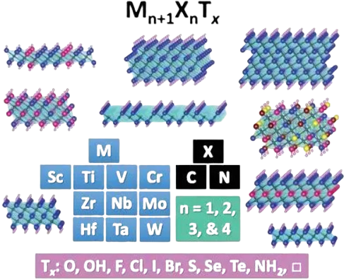

<p align="center">
  
</p>
# MXene Formation Energy Prediction via Machine Learning

A machine-learning study predicting the formation energy of M_n+1X_nT_x MXenes (M = transition metal, X = Carbon or Nitrogen, T = termination) from composition-only descriptors, using a 275-entry DFT dataset for training and original Quantum ESPRESSO calculations as independent validation — including a deliberate out-of-training-distribution test case.

## Motivation

High-throughput MXene screening is typically bottlenecked by the cost of running DFT on every candidate composition. This project asks a narrower, feasibility-scoped question: starting from an existing DFT dataset of 275 M_n+1X_nT_x MXenes, can a composition-only ML model predict formation energy well enough to be useful for pre-screening, and — critically — does that model actually generalize to compositions it has never seen, rather than just interpolating within the training set?

This project was deliberately scoped to stay tractable on local CPU-only hardware: no new DFT dataset was generated, and only a small number of validation structures (≤10 atoms per cell) were computed directly.

## Research Questions

1. How well can composition-only (Magpie) descriptors predict MXene formation energy, and is 275 data points enough for the learning curve to plateau?
2. Which descriptors dominate the prediction, and are they consistent with known MXene chemistry?
3. Does a model trained only on single-metal (M_n+1X_nT_x) MXenes generalize to out-of-distribution compositions it has never seen — including compositions that break the single-metal assumption entirely?

## Data

| Item | Detail |
|---|---|
| Source | JARVIS-DFT `mxene275` dataset (NIST) |
| Size | 275 MxCTx monolayer MXenes |
| Target | Formation energy (eV/atom), as provided by the source dataset |
| Features | Composition-only: Magpie elemental-property statistics (`matminer.ElementProperty`, preset `magpie`) derived from parsed formula |
| Note | Work function was the originally intended target; it is not available in `mxene275`, so the project scope shifted to formation energy during data audit (see `notebooks/01_data_audit.ipynb`) |

## Methodology (summary — full detail in notebooks)

**Feature engineering:** Formula strings parsed from dataset IDs → `pymatgen.Composition` → Magpie elemental-property featurization (`matminer`).

**Model:** Random Forest Regressor (`scikit-learn`, 200 trees), trained on an 80/20 split for the main fit, with model generalization additionally assessed via **GroupKFold cross-validation grouped by metal M** — a deliberately harder test than a random split, since it checks generalization across metals rather than within them.

**Validation design — two tiers:**
- *In-dataset / cross-code consistency check:* QE formation energies for two compositions (Ti₂C(OH)₂, Zr₂C(OH)₂) that **are** present in the training set, checking whether an independent DFT code/pseudopotential/functional setup agrees with the source dataset.
- *Out-of-distribution generalization check:* QE formation energy for **Mo₂TiC₂**, a composition **absent from the training set** and structurally different from it (two distinct metal species in one formula unit, rather than the single-metal M_n+1X_nT_x pattern the model was trained on).

**DFT reference energies:** Formation energy computed as
`E_form = [E_total(MXene) − Σ(nᵢ·μᵢ)] / N_atom`,
with elemental reference chemical potentials μᵢ taken from bulk metal/carbon calculations and **molecular (O₂, H₂) rather than bulk** references for O and H, consistent with standard formation-energy convention.

## Key Results

### Model performance

| Metric | Value |
|---|---|
| Group K-Fold R² (grouped by metal M, 5 folds) | 0.941 / 0.909 / 0.909 / 0.854 / 0.803 |
| Mean R² (group k-fold) | 0.883 |
| Learning curve | Validation score still rising at the largest training size tested — **dataset has not reached a clear plateau** |

### Feature importance

Electronegativity-related Magpie descriptors (`MagpieData range Electronegativity`, `MagpieData avg_dev Electronegativity`) dominate feature importance, consistent with the known strong dependence of MXene electronic/energetic properties on termination electronegativity.

### DFT validation

| Formula | Role | DFT formation energy (eV/atom) | ML prediction (eV/atom) | Error |
|---|---|---|---|---|
| Ti₂C(OH)₂ | In-dataset (cross-code check) | −1.317 | −1.427 | −0.110 |
| Zr₂C(OH)₂ | In-dataset (cross-code check) | −1.265 | −1.436 | −0.172 |
| Mo₂TiC₂ | **Out-of-distribution** | −0.613 | +0.009 | **+0.621** |

## Answers to the Research Questions

**Q1 — Is 275 data points enough?** Model fit metrics look reasonable (mean group-CV R² ≈ 0.88), but the learning curve has not plateaued — more training data would likely still improve the model. This dataset size is adequate for a feasibility study, not a final production model.

**Q2 — Which descriptors dominate?** Termination electronegativity statistics dominate feature importance, matching expected MXene chemistry — a useful sanity check that the model is learning physically sensible relationships rather than spurious correlations.

**Q3 — Does the model generalize out-of-distribution?** No, not reliably. The two in-dataset validation points (Ti₂C(OH)₂, Zr₂C(OH)₂) show small, consistent errors (~0.11–0.17 eV/atom) attributable to differences in DFT setup (code, pseudopotentials, functional) between this work and the source dataset. The out-of-distribution case, Mo₂TiC₂, shows a much larger error (0.62 eV/atom) and — more seriously — the **wrong sign**: the model predicts a thermodynamically unfavorable (positive) formation energy for a structure DFT shows to be stable. This is strong evidence that a model trained exclusively on single-metal M_n+1X_nT_x MXenes does not reliably extrapolate to bimetallic/ordered double-M compositions, which are structurally outside its training distribution.

## Limitations

- Training data limited to 275 single-metal M_n+1X_nT_x MXenes; no bimetallic/double-M structures were present in training, which directly explains the Q3 failure case above.
- Learning curve does not plateau at the current dataset size — reported model metrics should be read as a feasibility result, not a converged final model.
- Only two in-dataset and one out-of-distribution structure were validated against original DFT; this is sufficient to demonstrate a generalization failure mode, not to comprehensively characterize model accuracy.
- DFT validation was run with Quantum ESPRESSO, while the source dataset (`mxene275` / JARVIS) uses a different code and functional setup (OptB88-vdW); the ~0.1–0.2 eV/atom in-dataset discrepancy reflects this methodological difference, not necessarily model error.
- O and H reference chemical potentials were taken from molecular (O₂, H₂) phases; bulk-phase references were computed but not used as the primary reference — this choice is a known source of sensitivity in formation-energy definitions and is not exhaustively stress-tested here.
- All DFT validation structures were kept small (≤10 atoms/cell) to remain tractable on local CPU-only hardware
- With only one out-of-distribution test point, the magnitude of the generalization error (0.62 eV/atom) should be read as a single data point illustrating a failure mode, not a statistically robust error estimate.

## Repository Structure

```
mxene-ml-formation-energy/
├── README.md
├── environment.yml
├── .gitignore
├── data/
│   ├── raw/
│   ├── processed/
│   │   ├── predictions.csv
│   │   └── predictions_all.csv
│   └── dft_validation/
│       ├── formation_energy_qe.csv
│       ├── comparison.csv
│       ├── qe_inputs/
│       │   ├── references/
│       │   └── candidates/
│       └── qe_outputs/
│           └── total_energies.csv
├── notebooks/
│   ├── 01_data_audit.ipynb
│   ├── 02_features_models.ipynb
│   └── 03_dft_validation.ipynb
├── src/
│   └── model_rf.joblib
└── figures/
```

## Software Used

- [Quantum ESPRESSO](https://www.quantum-espresso.org/) — DFT total-energy calculations (`pw.x`)
- **JARVIS-tools** — dataset access (`mxene275`)
- **pymatgen, matminer** — composition parsing and Magpie featurization
- **scikit-learn** — Random Forest regression, cross-validation, learning curves
- **Python (NumPy, Pandas, Matplotlib, joblib)** — data handling, plotting, model persistence

## Reproducing the Results

```bash
conda env create -f environment.yml
conda activate mxene-ml

# 1. Audit dataset and confirm available targets
jupyter notebook notebooks/01_data_audit.ipynb

# 2. Feature engineering, model training, cross-validation, learning curve
jupyter notebook notebooks/02_features_models.ipynb

# 3. DFT validation (requires QE total energies already computed — see data/dft_validation/qe_inputs/)
jupyter notebook notebooks/03_dft_validation.ipynb
```

QE reference and candidate calculations (`data/dft_validation/qe_inputs/`) were run with `pw.x` on relaxed structures; see input files for cutoff, k-mesh, and pseudopotential details used for each system.
